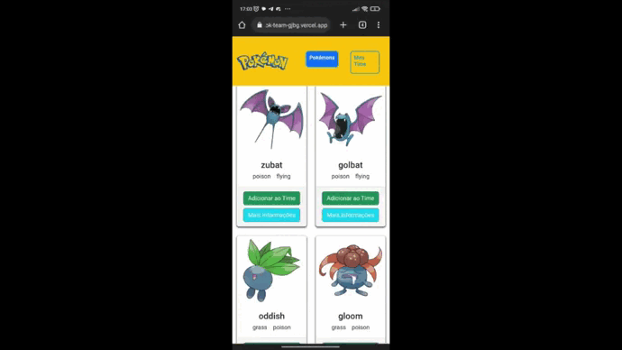

<h1 align="center">
  PokTeam
</h1>

<br />

<div align="center">
  <a href="https://pok-team-gjbg.vercel.app/" target="_blank" rel="noreffer">
    
    <h4>PokTeam</h4>
  </a>
</div>

## Indice

- [Indice](#indice)
- [🧾 Sobre](#-sobre)
- [🚀 Funcionalidades](#-funcionalidades)
- [👩🏻‍💻 Tecnologias](#-tecnologias)
- [🏳️ Como baixar e executar o projeto](#-como-baixar-e-executar-o-projeto)
- [✅ Resultado (Preview)](#-resultado-preview)

---

## 🧾 Sobre

O PokTeam é um aplicativo web que lista todos os Pókemons da api [https://pokeapi.co/](https://pokeapi.co/).
No site, podemos ver todos os Pókemons disponiveis, pesquisar por nome e aplicar filtro de tipo, ver mais informações de um Pokmon expecifico, além da criação de um time com até 5 Pókemons, esse time ficará salvo no navegador.

---

## 🚀 Funcionalidades

- Listagem de pókemons
- Adicionar e remover pókemons do time
- Filtrar pókemons por:
  - Nome (informar no input o nome correto do pókemon)
  - Tipo (em um filtro escolher um tipo que deseja usar de filtro)
- Exibir mais informações sobre um pókemon
- Contruir um time com até 5 pókemons

---

## 👩🏻‍💻 Tecnologias

#### O projeto foi desenvolvido utilizando as seguintes tecnologias:
- [React Native](https://reactnative.dev/docs/getting-started)
- [Expo](https://docs.expo.dev/)
- [Expo GO](https://expo.dev/client)
- [VS Code](https://code.visualstudio.com/)
- [ESLint](https://eslint.org/)
- [Prettier](https://prettier.io/)

---

## 🏳️ Como baixar e executar o projeto

Para clonar e executar esta aplicação na sua máquina é necessário ter instalado:

- [Git](https://git-scm.com/)
- [Npm](https://docs.npmjs.com/about-npm)
- [Node.js](https://nodejs.org/en/)

```bash

  # Clonar o repositório
  $ git clone https://github.com/PedroEmanuelLima/PokTeam.git

  # Entrar no diretório
  $ cd PokTeam

  # Instalar as dependências
  $ npm install ou yarn install

  # Iniciar o projeto
  $ npm start

```

<br/>

## ✅ Resultado (Preview):

Web | Mobile
:--------- | :------:
 | 

<br />

Desenvolvimento:
| [<br><sub>Pedro Emanuel</sub>](https://github.com/PedroEmanuelLima) |
| :---: |
<br />
